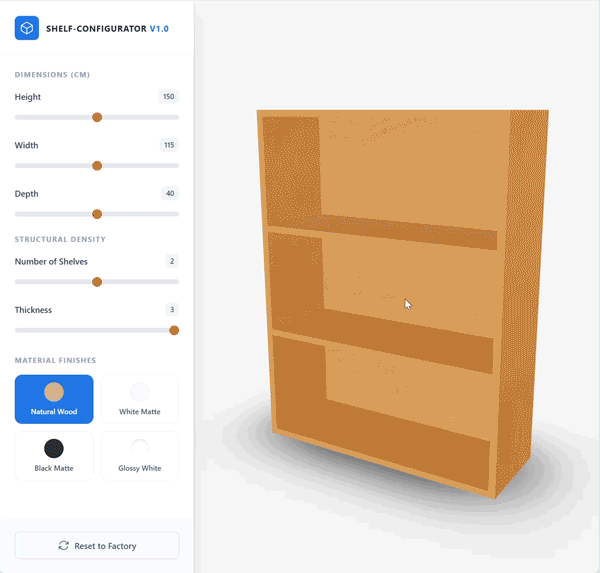
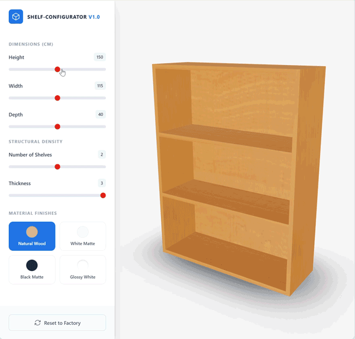

# Parametric 3D Shelf Configurator
A shelf configurator using React, typescript, R3F and Drei

A highly performant, data-driven 3D configuration tool built as a technical demonstration for CPQ (Configure, Price, Quote) architecture.

This project allows users to dynamically configure a parametric shelf in real-time. It emphasizes a strict separation of concerns between user state, geometric computation (generating a production-ready Bill of Materials), and the 3D rendering pipeline.

## Core Architecture

The application is built on a standard CPQ data flow:

1. **State Management (Zustand):** Stores only the raw parameters (Width, Height, Depth, Material, Shelf Count). It does *not* store 3D mesh instances or Three.js objects.
2. **Procedural Geometry Engine (`geometry.ts`):** A C-style pure function that takes the state parameters and calculates the exact spatial dimensions and coordinates for every required board. It handles complex conditional logic, such as automatically generating vertical support dividers when the width exceeds 150cm, ensuring meshes never intersect.
3. **The View Layer (React-Three-Fiber):** Acts purely as a "dumb terminal." It maps over the calculated Bill of Materials (BOM) and reconstructs primitive box geometries on the fly, preventing memory leaks and preserving optimal performance.

## Key Technical Features

* **Algorithmic Subdivision:** Horizontal shelves are dynamically split across mathematically generated columns to prevent intersecting geometry—creating a physically accurate, factory-ready parts list.
* **Dynamic UV Mapping:** Bounding box dimensions are passed directly to the material generation layer to dynamically adjust `texture.repeat`. This ensures physically based rendering (PBR) textures (like wood grain) scale accurately across varying lengths without stretching.
* **Optimized Reconciliation:** Heavy calculations and array generations are memoized (`useMemo`) to guarantee a flawless 60 FPS, even during continuous slider drag events.
* **Strictly Typed:** End-to-end TypeScript interfaces ensure data integrity between the state, the geometry calculator, and the renderer.

## Tech Stack

* **Frontend Framework:** React 18, Vite
* **Language:** TypeScript
* **3D Engine:** Three.js, React-Three-Fiber (@react-three/fiber), Drei (@react-three/drei)
* **State Management:** Zustand
* **Styling:** Tailwind CSS

## Getting Started

### Prerequisites
* Node.js (v18+ recommended)
* npm or yarn

### Installation

1. Clone the repository:
   ```bash
   git clone <your-repo-url>
   cd parametric-shelf-configurator

2. Install dependencies:

    ```Bash
    npm install
    ```

3. Texture Setup: To view the PBR materials, ensure you have placed your tileable textures in the public directory following this structure:

```
    public/
    └── textures/
        ├── natural_wood/
        │   ├── color.jpg
        │   ├── roughness.jpg
        │   └── normal.jpg
```
(Note: For testing, you can download free 1K/2K textures from PolyHaven or AmbientCG).

4. Start the development server:

```bash
npm run dev

```





